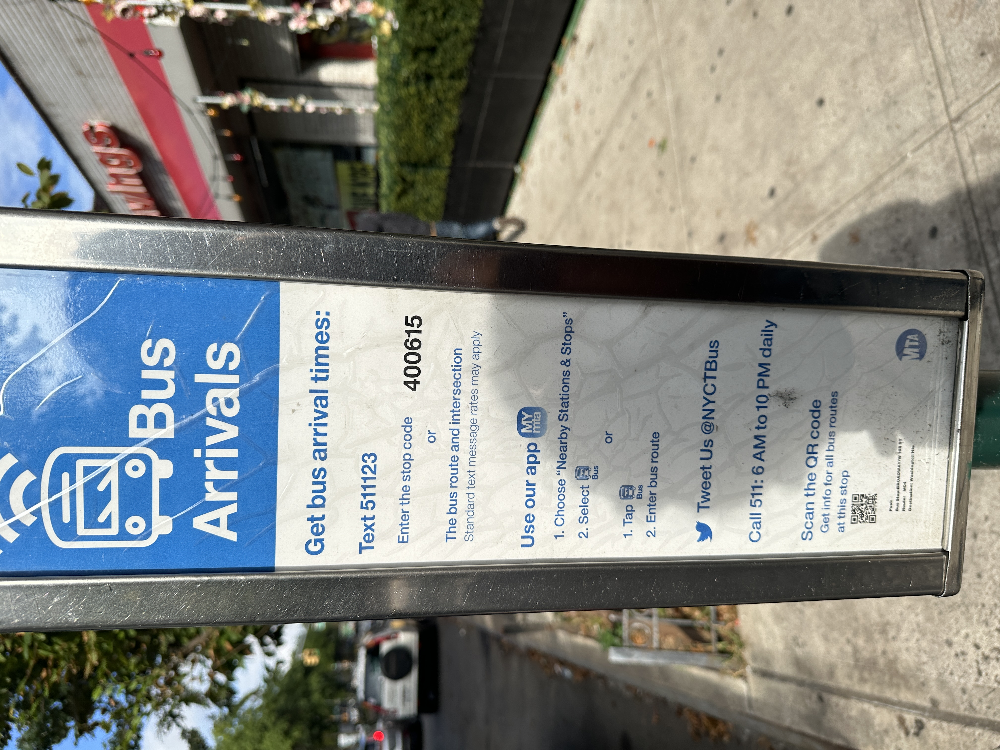
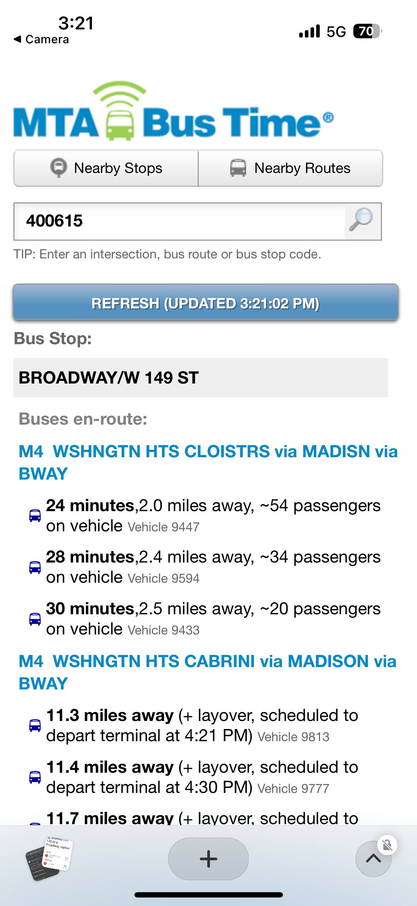
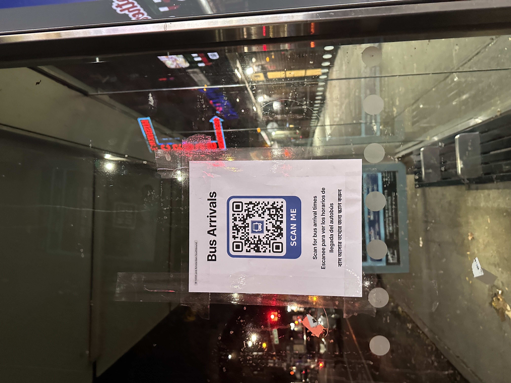
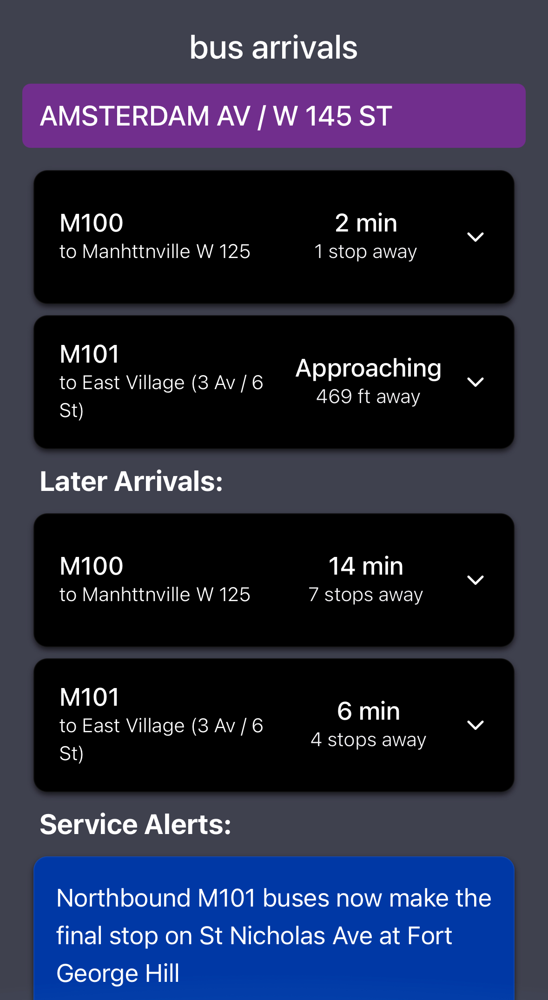

# Web app for viewing live bus arrival times at NYC bus stations

Available at [https://rdas1.github.io/bus-time/](https://rdas1.github.io/bus-time/)

# Why?

Only 1% of NYC's 15k bus stops have electronic signage indicating bus arrivals times. At all other stops, riders are directed to a software solution called MTA Bus Time via text-heavy, cluttered signs:

    

These signs provide 5 options for accessing bus arrival times. Rather than emphasize the system’s flexibility, this graphic design overwhelms potential users and makes what should be a simple task seem overly complicated. Moreover, the interfaces themselves are difficult and often unpleasant to use. The tiny QR code in the image above, for example, leads to the following functional but somewhat unappealing mobile web app:

For my Human-Computer Interaction course project, I redesigned both the signage and the mobile web app for accessing bus arrival times from MTA bus stops.

I developed a web app, available at [this link](https://rdas1.github.io/bus-time/#/403483), that retrieves and displays bus arrival times for any given stop (specified as a URL parameter). I designed and put up signs at four stations in Upper Manhattan with QR codes that lead to this website, so that real users can view bus arrival times. 

So far, they've been totaling about 40 scans per day. I'm planning to put up more signs at other stations across NYC so that more people can easily view bus arrival times.

